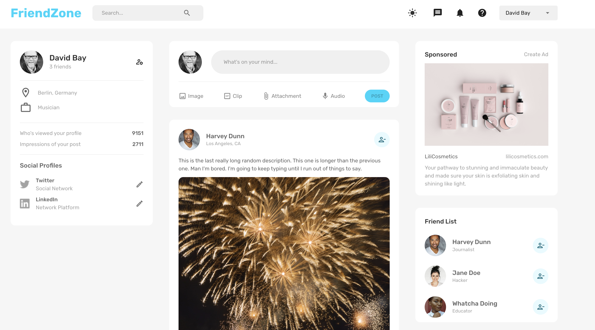
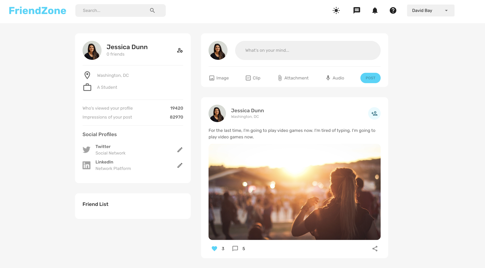

# FriendZone - Social App

FriendZone is a MERN (MongoDB, Express.js, React.js, Node.js) application that allows users to connect with friends, create posts, upload photos, and view profile pages.



## Getting Started

To get started with FriendZone, follow the instructions below:

### Prerequisites

Make sure you have the following software installed on your machine:

- Node.js
- MongoDB

### Installation

1. Clone the repository:

   ```shell
   git clone <repository-url>

2. Install server dependencies:

   ```shell
   cd server
   npm install

3. Install client dependencies:

   ```shell
   cd client
   npm install

### Running the Application
1. Start the server
 
 
   ```shell
   cd server
   npm start
The server will run on `http://localhost:3001`.


2. Start the client

   ```shell
   cd client
   npm install
The client will run on `http://localhost:3000`.

3. Open your web browser and visit `http://localhost:3000` to access FriendZone.

## Features
FriendZone offers the following features:

- User authentication (login and registration)

- Adding friends

- Creating and editing posts

- Like posts

- Uploading photos

- Profile page with user information




## Technologies Used
FriendZone is built using the following technologies:

- **MongoDB** - A NoSQL database used for storing user data and posts.

- **Express.js** - A web application framework used for building the server-side API.

- **React.js** - A JavaScript library used for building the client-side user interface.

- **Node.js** - A JavaScript runtime used for running the server.


